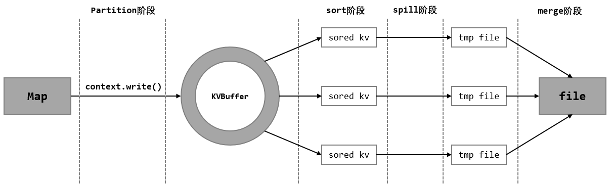
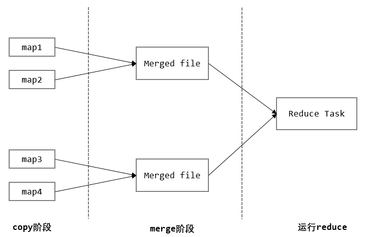

# Map Reduce 流程







2.1 partition 阶段
----------------

查看`MapTask.runNewMapper`方法源码可以看到这里创建了用于输出的对象：

```
if (job.getNumReduceTasks() == 0) {
    output = new NewDirectOutputCollector(taskContext, job, umbilical, reporter);
} else {
    output = new NewOutputCollector(taskContext, job, umbilical, reporter);
}
```

进入`output = new NewOutputCollector(taskContext, job, umbilical, reporter);`内部，这个类继承了`RecordWriter<K, V>`类，并重写了`write(K, V)`方法：

```
private class NewOutputCollector<K,V>
        extends org.apache.hadoop.mapreduce.RecordWriter<K,V> {
    private final MapOutputCollector<K,V> collector;
    private final org.apache.hadoop.mapreduce.Partitioner<K,V> partitioner;
    private final int partitions;

    @SuppressWarnings("unchecked")
    NewOutputCollector(org.apache.hadoop.mapreduce.JobContext jobContext,
                       JobConf job,
                       TaskUmbilicalProtocol umbilical,
                       TaskReporter reporter
                       ) throws IOException, ClassNotFoundException {
        collector = createSortingCollector(job, reporter);
        partitions = jobContext.getNumReduceTasks();
        if (partitions > 1) {
            partitioner = (org.apache.hadoop.mapreduce.Partitioner<K,V>) ReflectionUtils.newInstance(jobContext.getPartitionerClass(), job);
        } else {
            partitioner = new org.apache.hadoop.mapreduce.Partitioner<K,V>() {
                @Override
                public int getPartition(K key, V value, int numPartitions) {
                    return partitions - 1;
                }
            };
        }
    }

    @Override
    public void write(K key, V value) throws IOException, InterruptedException {
        collector.collect(key, value, partitioner.getPartition(key, value, partitions));
    }

    @Override
    public void close(TaskAttemptContext context
    ) throws IOException,InterruptedException {
        try {
            collector.flush();
        } catch (ClassNotFoundException cnf) {
            throw new IOException("can't find class ", cnf);
        }
        collector.close();
    }
}
```

可以看到在`write`方法中调用了`partitioner.getPartition(key, value, partitions)`这个方法来实现分区。

> 以前搜索 Shuffle 分区是如何实现的时候，都说是默认是哈希分区

这里可以看到在`NewOutputCollector`构造方法中，为`partitioner`赋值时，使用了反射。那我们进入`JobContext`接口的实现类`JobContextImpl`中：

```
@SuppressWarnings("unchecked")
public Class<? extends Partitioner<?,?>> getPartitionerClass() throws ClassNotFoundException {
    return (Class<? extends Partitioner<?,?>>) conf.getClass(PARTITIONER_CLASS_ATTR, HashPartitioner.class);
}
```

我们可以看到默认的分区类就是`HashPartitioner`，然后我们就可以进入`HashPartitioner`中，查看分区的具体实现了：

```
public class HashPartitioner<K, V> extends Partitioner<K, V> {
    
    public int getPartition(K key, V value, int numReduceTasks) {
          return (key.hashCode() & Integer.MAX_VALUE) % numReduceTasks;
    }
}
```

** `MapTask`有个非常重要的内部类`MapOutputBuffer`，它实现了许多重要的功能，比如 **

2.2 sort 阶段和 spill 阶段
---------------------

> 以前查资料的时候得知 sort 默认使用的是快速排序

这里可以在`MapOutputBuffer.inint()`中看到，通过反射创建了`IndexedSorter`对象，并默认指定了`QuickSort`：

```
sorter = ReflectionUtils.newInstance(job.getClass("map.sort.class", QuickSort.class, IndexedSorter.class), job);
```

那么排序使如何实现的呢？没错就是在`MapOutputBuffer`内部实现的：

```
private void sortAndSpill() throws IOException, ClassNotFoundException, InterruptedException {
    
    
    final long size = distanceTo(bufstart, bufend, bufvoid) + partitions * APPROX_HEADER_LENGTH;
    
    FSDataOutputStream out = null;
    try {
        
        final SpillRecord spillRec = new SpillRecord(partitions);
        final Path filename = mapOutputFile.getSpillFileForWrite(numSpills, size);
        out = rfs.create(filename);

        final int mstart = kvend / NMETA;
        
        final int mend = 1 +  (kvstart >= kvend ? kvstart : kvmeta.capacity() + kvstart) / NMETA;
        
        sorter.sort(MapOutputBuffer.this, mstart, mend, reporter);
        int spindex = mstart;
        final IndexRecord rec = new IndexRecord();
        final InMemValBytes value = new InMemValBytes();
        
        for (int i = 0; i < partitions; ++i) {
            IFile.Writer<K, V> writer = null;
            try {
                long segmentStart = out.getPos();
                FSDataOutputStream partitionOut = CryptoUtils.wrapIfNecessary(job, out);
                writer = new Writer<K, V>(job, partitionOut, keyClass, valClass, codec, spilledRecordsCounter);
                
                if (combinerRunner == null) {
                    
                    DataInputBuffer key = new DataInputBuffer();
                    while (spindex < mend && kvmeta.get(offsetFor(spindex % maxRec) + PARTITION) == i) {
                        final int kvoff = offsetFor(spindex % maxRec);
                        int keystart = kvmeta.get(kvoff + KEYSTART);
                        int valstart = kvmeta.get(kvoff + VALSTART);
                        key.reset(kvbuffer, keystart, valstart - keystart);
                        getVBytesForOffset(kvoff, value);
                        writer.append(key, value);
                        ++spindex;
                    }
                } else {
                    
                    int spstart = spindex;
                    while (spindex < mend && kvmeta.get(offsetFor(spindex % maxRec) + PARTITION) == i) {
                        ++spindex;
                    }
                    
                    
                    if (spstart != spindex) {
                        combineCollector.setWriter(writer);
                        RawKeyValueIterator kvIter = new MRResultIterator(spstart, spindex);
                        combinerRunner.combine(kvIter, combineCollector);
                    }
                }

                
                writer.close();

                
                rec.startOffset = segmentStart;
                rec.rawLength = writer.getRawLength() + CryptoUtils.cryptoPadding(job);
                rec.partLength = writer.getCompressedLength() + CryptoUtils.cryptoPadding(job);
                spillRec.putIndex(rec, i);

                writer = null;
            } finally {
                if (null != writer) writer.close();
            }
        }

        if (totalIndexCacheMemory >= indexCacheMemoryLimit) {
            
            Path indexFilename = mapOutputFile.getSpillIndexFileForWrite(numSpills, partitions * MAP_OUTPUT_INDEX_RECORD_LENGTH);
            spillRec.writeToFile(indexFilename, job);
        } else {
            indexCacheList.add(spillRec);
            totalIndexCacheMemory += spillRec.size() * MAP_OUTPUT_INDEX_RECORD_LENGTH;
        }
        LOG.info("Finished spill " + numSpills);
        ++numSpills;
    } finally {
        if (out != null) out.close();
    }
}
```

2.3 merge 阶段
------------

`MapOutputBuffer`有一个`mergeParts()`方法，从名字就可以得知 merge 的实现就是在`MapOutputBuffer.mergeParts()`中实现的。

和 Map 一样，我们需要查找`ReduceTask`源码来分析，看一下它的`run()`方法，这里就只列一下比较重要的几行：

```
ShuffleConsumerPlugin shuffleConsumerPlugin = null;
Class<? extends ShuffleConsumerPlugin> clazz = job.getClass(MRConfig.SHUFFLE_CONSUMER_PLUGIN, Shuffle.class, ShuffleConsumerPlugin.class);                  
shuffleConsumerPlugin = ReflectionUtils.newInstance(clazz, job);

ShuffleConsumerPlugin.Context shuffleContext = 
      new ShuffleConsumerPlugin.Context(getTaskID(), job, FileSystem.getLocal(job), umbilical, 
                  super.lDirAlloc, reporter, codec, 
                  combinerClass, combineCollector, 
                  spilledRecordsCounter, reduceCombineInputCounter,
                  shuffledMapsCounter,
                  reduceShuffleBytes, failedShuffleCounter,
                  mergedMapOutputsCounter,
                  taskStatus, copyPhase, sortPhase, this,
                  mapOutputFile, localMapFiles);
shuffleConsumerPlugin.init(shuffleContext);

rIter = shuffleConsumerPlugin.run();
```

下面我们看一下`ShuffleConsumerPlugin`的核心代码，这个接口只有一个实现类`Shuffle`，在它的`run()`方法中：

3.1 拉取 Map 结果：
--------------

```
boolean isLocal = localMapFiles != null;
final int numFetchers = isLocal ? 1 : jobConf.getInt(MRJobConfig.SHUFFLE_PARALLEL_COPIES, 5);
Fetcher<K,V>[] fetchers = new Fetcher[numFetchers];

if (isLocal) {
    fetchers[0] = new LocalFetcher<K, V>(jobConf, reduceId, scheduler,
            merger, reporter, metrics, this, reduceTask.getShuffleSecret(),
            localMapFiles);
    fetchers[0].start();
} else {
    for (int i=0; i < numFetchers; ++i) {
        fetchers[i] = new Fetcher<K,V>(jobConf, reduceId, scheduler, merger,
                reporter, metrics, this,
                reduceTask.getShuffleSecret());
        fetchers[i].start();
    }
}
```

3.2 Reduce 的 merge：
-------------------

在`Shuffle`初始化时，会创建`MergeManger`对象，对 merge 进行管理：

```
@Override
public void init(ShuffleConsumerPlugin.Context context) {
    this.context = context;
    
    scheduler = new ShuffleSchedulerImpl<K, V>(jobConf, taskStatus, reduceId,
            this, copyPhase, context.getShuffledMapsCounter(),
            context.getReduceShuffleBytes(), context.getFailedShuffleCounter());
    
    merger = createMergeManager(context);
}
protected MergeManager<K, V> createMergeManager(ShuffleConsumerPlugin.Context context) {
    return new MergeManagerImpl<K, V>(reduceId, jobConf, context.getLocalFS(),
        context.getLocalDirAllocator(), reporter, context.getCodec(),
        context.getCombinerClass(), context.getCombineCollector(), 
        context.getSpilledRecordsCounter(),
        context.getReduceCombineInputCounter(),
        context.getMergedMapOutputsCounter(), this, context.getMergePhase(),
        context.getMapOutputFile());
}
```

上面可以看到实际上创建了`MergeManagerImpl`，进入它的内部，可以看到：

```
this.inMemoryMerger = createInMemoryMerger();
this.inMemoryMerger.start(); 
this.onDiskMerger = new OnDiskMerger(this);
this.onDiskMerger.start();  
this.mergePhase = mergePhase;
```

